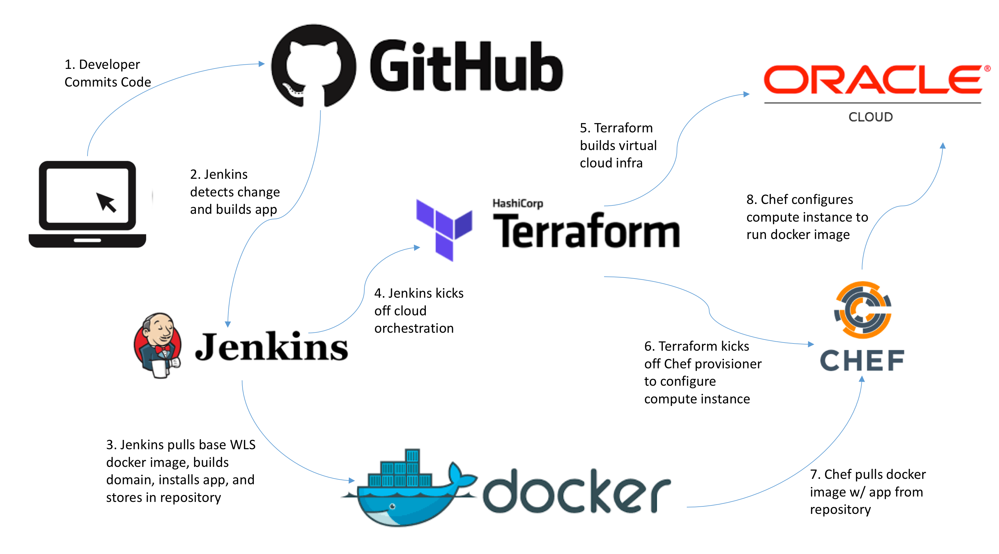

# Java EE Infrastructure as Code (IaC) Sample
Ed Shnekendorf, Cloud Platform Architect, Oracle

## Overview
This repository provides the code used to demonstrate IaC concepts using Docker, Jenkins, and Weblogic Server.  It is meant to be used in conjunction with the [Terraform/Chef Sample](https://github.com/eshneken/terraform-bmcs-weblogic-jenkins-chef) to provide an end-to-end automation sample that implements the following architecture:

This project encapsulates steps 1-3 while the [Terraform/Chef Sample](https://github.com/eshneken/terraform-bmcs-weblogic-jenkins-chef) project handles steps 4-8.

This project leverages the private docker repository and Jenkins server/jobs that are set up as part of that project so start there first before setting this up.

## Project Organization

The contents of this project are executed by a Jenkins build job call **JEE_Sample_App**.

The **src** directory tree contains a simple Java EE application that leverages the Servlet/JSP spec.  Of course, it could be arbitrately complex and could leverage other parts of the Java EE ecosystem but I've chosen to keep it simple for this sample.  This is the application that is built and deployed to infrastructure using automation.  Its build is governed by the **pom.xml** file in the same directory.

Once the Maven build occurs, the next step is to dockerize the application.  This is governed by the **Dockerfile** which specifies a Weblogic base image (located in a private repository but originally pulled from the official [Docker Store](http://store.docker.com) into which a domain is created and the application is deployed.  Scripts that handle domain create and app deployment are foind in teh **container_scripts** folder.  

Finally, the newly composed Docker image is pushed back to the private Docker repo via a post-build callout to the **build-wls-with-app.sh** script.  Once this occurs, Jenkins follows up with a post-build action that triggers the Jenkins job created in [Terraform/Chef Sample](https://github.com/eshneken/terraform-bmcs-weblogic-jenkins-chef) to Terraform and Chef-provision an SDN and instance to run the Docker container we created.  The provide the linkage, Jenkins uses the **build-trigger-params.prop** file which contains the desired variables for the **Docker-Build Environment** job that you've configured in that project.

## Environment Setup

Since you have a Jenkins and Docker environment already set up as part of the [Terraform/Chef Sample](https://github.com/eshneken/terraform-bmcs-weblogic-jenkins-chef) this setup should be simple.  

As you did with the other project, you will want to fork this repository so that you can upade the repository location in the **Dockerfile** and **build-wls-with-app.sh** files to point to the DNS/IP of your instance.

Then, you will want to create a Jenkins **Maven Project** called **JEE_Sample_App**.  

Under **Source Code Management** you want to select **Git** and configure your repository URL and GitHub credentials.

Under **Build Triggers** select **Poll SCM** and put in a schedule of \* \* \* \* \*.  This will cause Jenkins to poll GitHub every minute.  For extra credit, knock yourself out and create a post-commit hook from Git ;)

Under **Build** select a Root POM of **pom.xml** and a Goal of **clean install**

Under **Post Steps** configue an **Execute Shell** take with a **Command** set to **/bin/bash build-wls-with-app.sh**

Finally, Under **Post-build Actions** select **Trigger parameterized build on other projects**.  The project to build is **Docker-Build Environment** and you want to select **Parameters from properties file** and set that value to **build-trigger-params.prop**.  

## Testing the Sample
To run this sample, you should be able to go to your GitHub project and edit the **src/main/webapp/welcome.jsp**.  There is a line titled **Change Text** which you can modify to trigger a build and to show that the app being built is actually what you're changing.

Expect the **JEE_Sample_App** job to take about 1 minute to run.  It will then trigger the **Docker-Build_Environment** job which will take about 6 minutes to run.  Once that job has completed, you can get the IP of terraformed instance either from the BMCS Console or from the job console output and open it in a browser (http://[public_ip]) which will resolve to the simple WebApp with your changes.

Once you're done, don't forget to manually run the **Docker-Destroy_Environment** job to clean up your infrastructure.